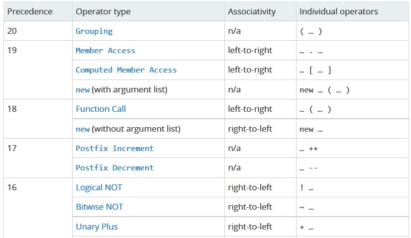

# 運算子的優先性與相依性

> 運算子優先性(operator precedence)：
>
> 表示在同一行程式中有不只一個運算子時，哪個運算子被優先運算，函數會依序運算有高優先性的運算子。
>
> ex. 類似數學的先乘除後加減。

> 運算子相依性(operator associativity)：
>
> 代表運算子被計算的順序。左到右的相依性(左相依性)或右到左的相依性(右相依性)。

有很多的運算子在同一行程式碼中，優先性能夠幫助判斷哪個運算子先運算，但是如果運算子優先性都一樣呢？這時就要看相依性了。

```javascript
var a = 2;
var b = 3;
var c = 4;
a = b = c; // 都是 '=' 運算子，優先性一樣，但是相依性是從右到左計算。
console.log(a); // 4
```

```javascript
// 前面說過，運算子需要兩個參數來傳回一個值，「+」會回傳兩個值總和，但「=」會回傳甚麼？
var a = 2;
var b = 3;
console.log(a = b); // 3
```



補充：[運算子優先性](https://developer.mozilla.org/en-US/docs/Web/JavaScript/Reference/Operators/Operator_Precedence)


[][][][]

| 標點符號 | 英文                                       |
| :--: | ---------------------------------------- |
|  []  | square brackets                          |
|  ()  | parentheses                              |
|  {}  | curly brackets                           |
|  :   | colon                                    |
|  ;   | semi-colon                               |
|  ''  | single quotation mark                    |
|  ""  | double quotation mark                    |
|  @   | at                                       |
|  #   | hashtag/number                           |
|  /   | slash                                    |
|  ~   | tilde                                    |
|  -   | hyphen(連字號)                              |
|  —   | dash(破折號)(但是：e-mail裡面那個常會說dash)          |
|  _   | underline                                |
|  .   | dot                                      |
|  &   | ampersand/and                            |
|  *   | asterisk                                 |
|  ,   | comma(逗點)                                |
|  ’   | apostrophe(撇號)                           |
|  +   | plus                                     |
|  -   | minus                                    |
|  ÷   | divide                                   |
|  ×   | multiply                                 |
|  !   | exclamation mark(英)、exclamation point(美) |
|      |                                          |
|      |                                          |
|      |                                          |
|      |                                          |
|      |                                          |