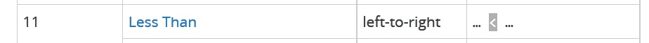

# 比較運算子

#### 強制轉型：coercion

```javascript
console.log(1 < 2 < 3);// true
但過程是 1 < 2 => true
true < 3 // 這時true會被強制轉型成 1
```

從上面的例子來看，運算子都一樣，根據相依性(associativity)，「<」是由左到右運算。



```javascript
console.log(3 < 2 < 1); // true
3 < 2 => false
false < 1 // 這時true會被強制轉型成 0
```

> 會造成上述結果，是因為運算子執行的順序以及值的強制轉型。
>
> javascript運算子想要做的是，當我想要比較兩個值，但兩邊型別不一樣時，它會試著強制將其中一方轉型。

```javascript
Number(false) // 0
Number(true) // 1
Number(undefined) // NaN
Number(null) // 0
```

在比較相等性時，不要使用「 == 」，javascript會做強制轉型，會讓程式碼難以預測；應該使用「 === 」，javascript就不會強制轉型。

```javascript
// ==
3 == 3      // true
"3" == 3    // true
false == 0  // true
null == 0   // false，null雖然可以被強制轉型成0，但在比較相等性的時候不會被轉型
null < 1    // true
'' == 0     // true
'' == false // true
```

```javascript
// ===
3 === 3      // false
"3" === 3    // false
false === 0  // false
null === 0   // false
'' === 0     // false
'' === false // false
```

補充：[「 == 」與「 === 」的比較](https://developer.mozilla.org/en-US/docs/Web/JavaScript/Equality_comparisons_and_sameness)