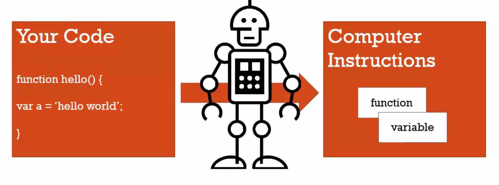

# 語法解析器、執行環境、詞彙環境

### 語法解析器(syntax parsers)

我們所寫的程式碼並不會被直接執行，而是有個中介的程式在我們的程式碼和電腦中間，轉換成電腦能讀懂的文字。例如瀏覽器裡的 javascript引擎就做這件事，它包含了很多東西在裡面，語法解析器是其中之一。

它會逐字閱讀我們的程式碼，做假設，遵守某些規則，判斷這是否有效，甚至可以在執行前改變我們的程式碼，這就是在我們的程式碼執行前發生的事。

```javascript
return;
```

例如看到「r」，我們可能是要寫「return」，所以它會預期接下來是「e」，最後在遇到「;」時結束。

如果看到的不是預期的東西，語法解析器則會認為這是個錯誤。

一個程式，能夠讀取程式碼並決定做何動作，如果你的code是有效的。

compiler，編譯器、直譯器，將我們所寫的code轉換成電腦能讀懂的文字。

-----

### 執行環境(execution context又譯為執行脈絡、執行上下文)

一個包裹，幫助管理正在執行的程式。

我們有許多詞彙環境，程式碼實際上所在位置，但哪個才是現在正在執行的？就是被執行環境所管理的。

執行環境包含了你寫的code，正在執行的code，但它所包含的不只是你所寫的code。

記住，你的code正在被轉換，正在被另一個東西(編譯器)處理，所以它在執行你的code，另外它也能夠做其他事。

無論你的程式碼何時執行，你的程式碼都被包在執行環境裡面。

----

### 詞彙環境(lexical environments)



代表程式碼在程式中實際所在的位置，詞彙這個字代表和文法有關，

現在詞彙環境存在於一些程式語言中，這些程式語言認為程式碼寫在哪裡很重要。

決定了javascript引擎會如何處理程式的所在位置，記憶體中的位置以及和其他程式的連結。

這個變數(var a)在詞彙上在函數裡面，也就是實際上程式碼的位置，它實際上位於哪裡，我們所寫的code並不會直接給電腦執行，而是被轉換成電腦懂的東西。

但是在那些詞彙環境很重要的程式語言中，表示你看到的東西可以給你一點方向，想像它實際上在電腦記憶體的位置，還有它會如何和其他變數、函數或其他程式作用。

這是因為編譯器覺得程式碼的位置很重要，幫助了語法解析器做決定，所以當我們在討論程式碼的詞彙環境時，我們其實是在討論「它被寫在哪裡？」、「它的周圍環境是甚麼？」