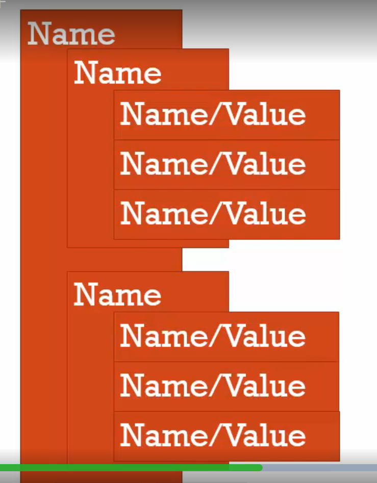

- name/vlaue pair

```javascript
Address = '100 Main St.';
```

- object

a collection of [name/vlaue pairs]

```javascript
Address:{
     Street:'Main',
     Number:100,
     Apratment:{
          Floor:3,
          Number:301
     }
}
```

