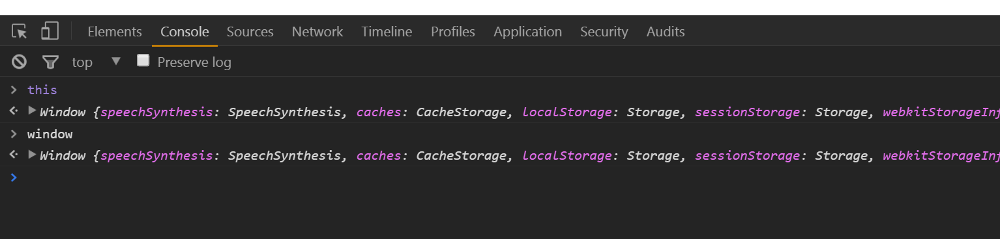

# 全域環境與全域物件

基礎執行環境(base execution context) or 全域執行環境(global execution context)，創造了兩件事

1. global object
2. special variable:this


執行空的html跟空的js檔案，雖然甚麼都沒有寫，但因為它已經執行javascript，因為執行了檔案，執行環境被創造了出來，上述兩個：***全域物件***跟***this***，也被創造了出來。



如果運行的是node.js，會是不同的物件。

在執行javascript時永遠會有個全域物件。

所以執行環境是在全域等級被創造的


全域物件：不在函數裡面。

程式碼或變數不在函數裡面時就是全域的。


```javascript
var a = 'Hello World';
function b(){
  
}
```

所有程式碼不在函數裡面，它們是全域的。

此時再查看window，會發現剛寫的var跟function在window裡面。


在javascript，當你創造這些變數和函數，你不是在函數裡面，那些變數與函數會和全域物件連接。

此時呼叫a跟window.a是一樣的。


所以變數和物件若不在函數裡面，它們就是全域物件。

