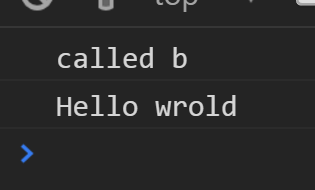
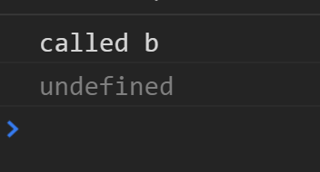
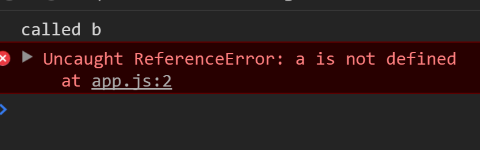
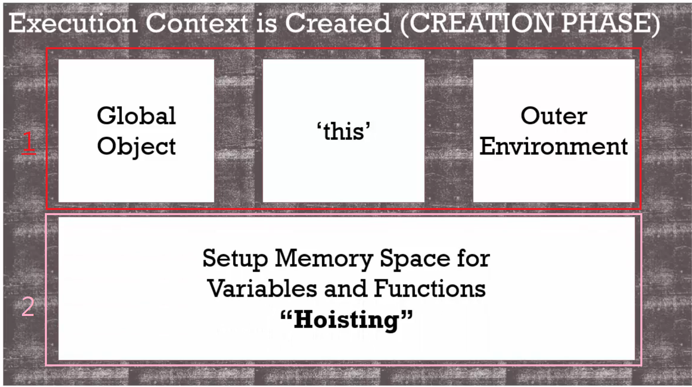

# 執行環境：創造(creation)與提升(hoisting)

(1)

```javascript
var a = 'Hellow World';
function b(){
	console.log('called b');
}
b();
console.log(a);
```



(2)對於一般的程式語言來說，若在定義函數b()跟變數a之前呼叫它們，則程式會出錯；

但對javascript來說，卻不是這樣，函數b()照常執行，變數a則是undefined。

這個現象叫做提升(hoisting)。

```javascript
b();
console.log(a);
var a = 'Hellow World';
function b(){
	console.log('called b');
}
```



(3)反之若將宣告變數a的code拿掉，則會報錯。

```javascript
b();
//console.log(a);
var a = 'Hellow World';
function b(){
	console.log('called b');
}
```



會造成(2)的結果是因為，網路上的流傳：

```javascript
var a = 'Hellow World';
function b(){
	console.log('called b');
}
b();
console.log(a);
```

javascript的函數與變數被提升到程式碼的最前面，但並不是這樣，a沒有被設值成「Hello world」。

比較像是：我已經宣告了變數a，之後再設值給它。

```javascript
var a;
function b(){
	console.log('called b');
}
b();
console.log(a);
a = 'Hellow World';
```

但仍然不是這樣，我們寫的code並不是直接被執行，而是被javascript引擎轉換成電腦看得懂的東西，
所以這不像是js移動你的code，然後執行它。



> javascript是這樣運作：即使變數與函數還沒有值卻可以取用。
>
> 因為執行環境分成兩階段創造，
>
> 1.創造階段(creation)
>
> 此時已有全域變數在記憶體中，還有this被設定在記憶體中。
>
> 全域物件只有在處理全域執行環境時才會參照到，但this永遠在執行環境中，還會創造外部環境。
>
> 2.提升階段(hoisting)
>
> 在創造階段中，當語法解析器執行你的code時，開始設定轉化你的程式碼時，它會知道你在哪裡創造變數與函數，所以這是在創造階段被設定，設定變數與函數在記憶體裡面，這個步驟就叫做提升。
>
> 不是真的把code搬到程式碼最上面，這表示在逐行執行程式碼之前，javascript引擎已經為變數與函數在記憶體中建立一個空間了，函數與變數已經存在於記憶體中了，所以當程式被逐行執行時，它可以找到它們：**函數b()**與**變數a**。

然而變數又不太一樣，

```javascript
b();
console.log(a);
var a = 'Hellow World';
function b(){
	console.log('called b');
}
```

可以看到**函數b()**已經全部在記憶體裡面了，代表函數裡的程式碼已經被執行了，然而下一個執行階段，它會發生當等號這種設值符號被設定時，所以js引擎為a空出記憶體空間時，它不知道a會是甚麼值，直到a被執行時才知道。

因此js引擎為a放上「undefined」的替代文字，這表示「我還不知道他的值」，如果不對a設值的話也會得到一樣的替代文字。

```javascript
b();
console.log(a);
var a;
function b(){
	console.log('called b');
}
```

所有js的變數一開始都會被設定成「undefined」；然後函數則是完全被設定好放進記憶體中。

但是依賴這種方法有時是不好的，例如當你的值真的是「undefined」，所以還是全部宣告完成之後再呼叫才不會落入陷阱。