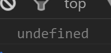
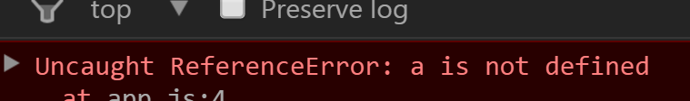

# javascript與undefined

undefined 是個特殊的關鍵字。

### not defined != undefined

```javascript
<<<undefined>>>
var a;
console.log(a);
```



```javascript
<<<not defined>>>
console.log(a);
執行環境被創造時，在創造階段沒有找到var a，所以它從未在記憶體中出現。
當程式執行這段程式碼之後，會說「嘿，我沒有在記憶體中找到a」。
```



undefined是javascript一開始幫我們預先設定好的值，所有變數被宣告(var a)之後，不管工程師有沒有塞值給該變數，javascript都會為我們塞個預設的值為undefined。

undefined不代表空的或不存在，這其實是個值，會占用記憶體空間。

```javascript
var a = undefined;
```

可以這麼做，但是不建議，因為無法分辨這個undefined是javascript設定的還是工程師自己設定的。