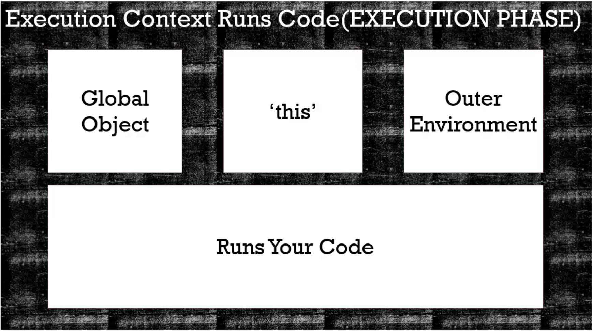
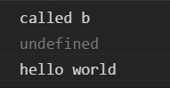

# 12.執行環境 - 程式執行



> 執行環境：先創造(A) -> 後執行(B)

```javascript
function b(){
  console.log('called b');
}
b();
console.log(a); // 1
var a = 'hello world';
console.log(a); // 2
```



兩次console.log(a)的結果並不一樣。

在*(A)創造階段*，設定了function b()這個函數，然後 var a 被設定為undefined；

接著在*(B)執行階段*，逐行執行，才會有上圖的輸出結果。