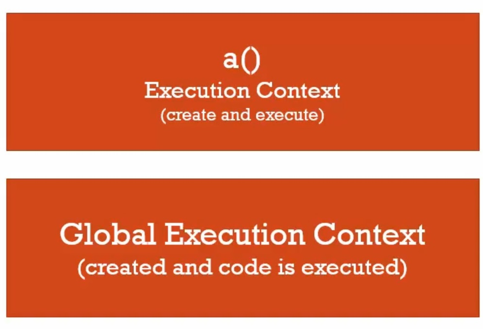
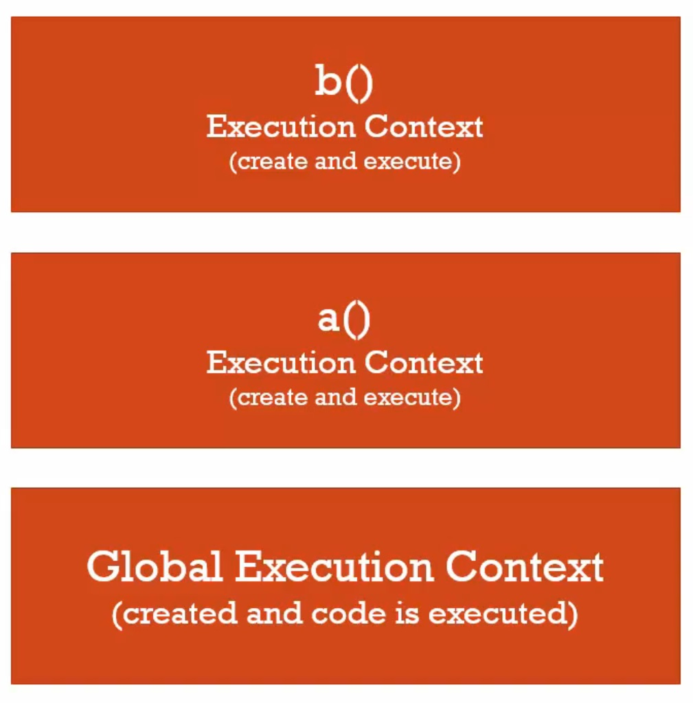

# 14.函數呼叫與執行堆

函數呼叫(invoke function、function invoking)

執行堆(execution stack)

```javascript
function b(){
  
}
function a(){
	b();
}
a();
```

每一次在javascirpt呼叫函數，就會創造一個新的執行環境，然後被放進執行堆(execution stack)中，所以一個新的執行環境被創造，就像全域執行環境一樣，它會有自己的記憶體空間給變數與函數。會經歷創造階段，然後逐行執行函數中的程式。

然而，如果我呼叫另一個函數(*b()*)，它會停止持行程式，創造另一個執行環境，然後執行。

> 每個函數都會創造一個執行環境，經過創造階段，然後逐行執行程式。

程式碼中實際排列的順序並不重要，在函數中剩下得程式碼順序也不會影響執行先後，假如換成以下這段：

```javascript
function a(){
	b();
  	var c;
}
function b(){
	var d;  
}
a();
var d;
```

函數a雖然在函數b前面，這些函數在創造階段就已經在記憶體中了，在全域執行環境被初始化時就存在了，在函數中的 var c跟var c也都在記憶體中了。

1.全域執行環境


2.執行函數a()，堆疊上去



3.執行函數b()，在往上堆疊



> 堆疊在最上面的就是正在執行的。
>
> 現在執行的程式就是目前的執行環境。
>
> 逐行執行。

4.函數b()執行完畢，執行環境離開(pop off)執行堆，接著執行還沒執行的那一行，也就是var c


5.函數a()執行完畢，被移出堆疊，執行環境離開(pop off)執行堆，下一行還沒被執行的程式，在全域執行環境中也就是最後的var d;


每當函數被呼叫，一個新的執行環境就被創造給函數，this變數被創造給那個函數，裡面的變數早在創造階段就已經建立了，然後程式碼被逐行執行；但每當函數被呼叫，即使是被自己呼叫，一個新的執行環境就會進入執行堆，然後當執行完畢，離開執行堆。

無論最上面是甚麼，那個就是正在執行的環境。逐行的、同步的。