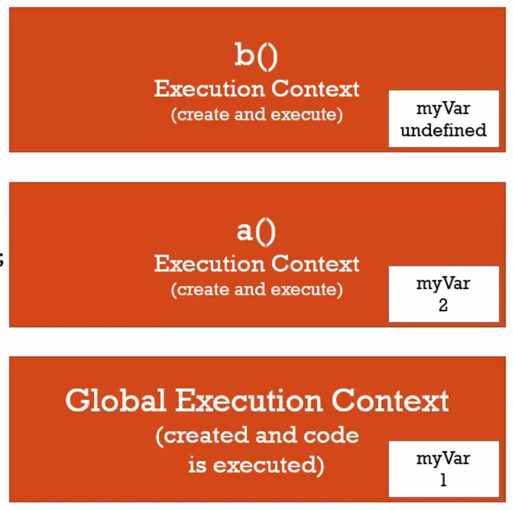

# 函數(functions)、環境(context)與變數環境(variable environments)

> 變數環境：只是描述你創造變數的位置，還有他在記憶體中和其他變數的關係，只要知道變數在哪裡？

```javascript
function b(){
	var myVar;
	console.log(myVar); // undefined
}
function a(){
	var myVar = 2;
  	console.log(myVar); // 2
  	b();
}
var myVar = 1;
console.log(myVar); // 1
a();
console.log(myVar); // 1

/*
* 當a()執行完畢，就回到全域執行環境，因為b()和a()的執行環境已經離開執行堆了，他們不見了。
* 正在執行的環境變為全域執行環境，而在這個環境中 myVar 的值為 1 。
*/
```



最底下全域執行環境被創造，var myVar、函數a()與函數b()被放進記憶體中，對全域執行物件來說，它的變數環境是全域物件，也就是瀏覽器的window。

所以當程式執行到 var myVar = 1 這一行時，在記憶體中的變數會的到 1 的值。

每個函數都會創造自己的執行環境，每個執行環境都會有自己的變數環境。

> scope：表示我們可以在哪裡看到變數

上述的每個變數都被定義在自己的執行環境，因為他們在函數裡面。每當呼叫函數，就會得到函數自己的執行環境。

雖然 var myVar 被宣告三次，他們是不同的、不一樣的，而且彼此沒有關聯。

