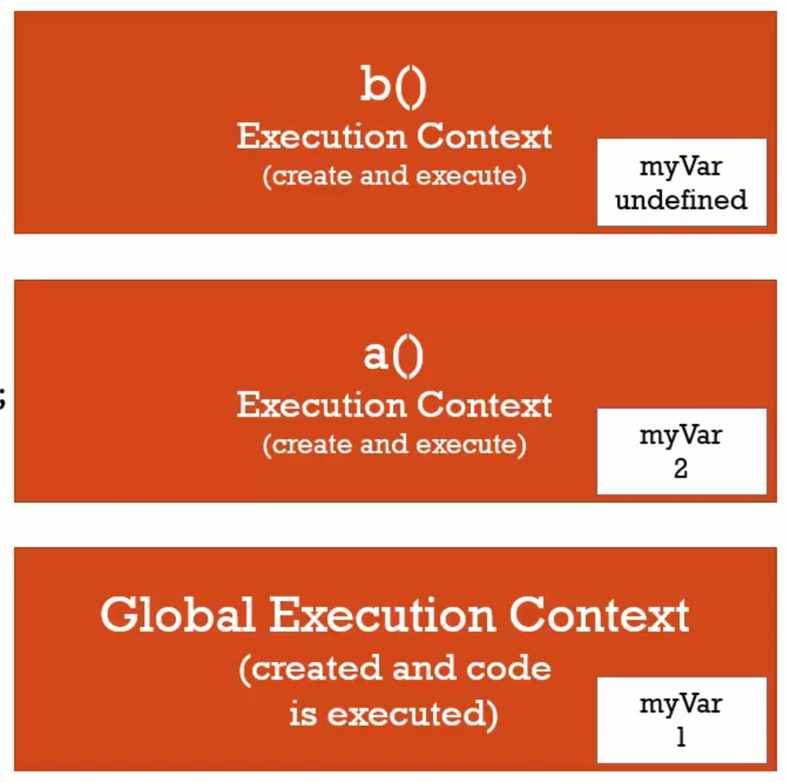
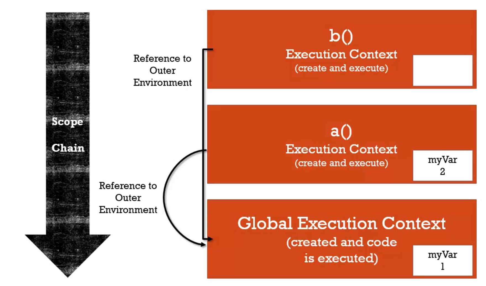
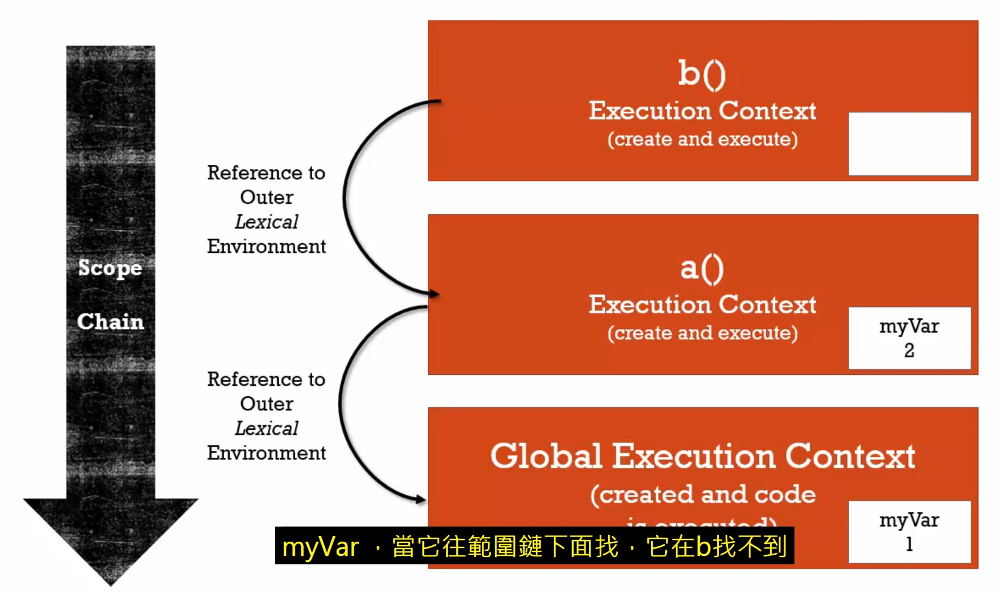

# 範圍鏈(scope chain)

> 「外部環境參照」(outer environment)：
>
> 當我們要處理變數時，javascript不只會在目前執行環境的變數環境中尋找，每一個執行環境都有特殊的東西被創造給你，像是變數 this ，外部環境的參照。
>
> 每個執行環境都有一個參照的外部環境，只要程式碼在執行，執行環境取得的變數環境不必是正下方的執行環境。反之，所參考到的是哪種外部環境？

> 「詞彙環境」(lexical environments)：參考第6節。

#### 範例一：

```javascript
function b(){
	var myVar;
	console.log(myVar); // undefined
}
function a(){
	var myVar = 2;  	
  	b();
}
var myVar = 1;
a();
```



-------------------------------------------------------------------

#### 範例二：

```javascript
function b(){	
	console.log(myVar); // 1
}
function a(){
	var myVar = 2;  	
  	b();
}
var myVar = 1;
a();

```



詞彙上，函數b()在全域環境，不在函數a()裡面，和最後一行的 var myVar = 1 同等級。

執行環境不重要，和它實際上在哪裡無關，函數a()可以跟函數b()互換位置。

執行的順序會決定它們如何被呼叫，這些執行環境如何被創造，javascript注重詞彙環境，當它面對每個執行環境都有的外部環境，當你需要某個執行環境內的程式碼變數。

如果找不到，它會到外部環境去尋找，在執行堆的下方，而它指向的外部環境，會依據函數實際上的位置而有所不同。

> 這整條鏈子就叫範圍鏈，「範圍」(scope)代表能取用這變數的地方，而「鏈」(chain)是外部環境參照的連結。

-------------------------------------------------------------------------

#### 範例三：

```javascript

function a(){
	var myVar = 2;  
    function b(){	
        console.log(myVar); // 2
    }  
  	b();
}
var myVar = 1;
a();
```



---------------------------------------

兩種分辨方式：

1.詞彙環境

2.誰創造了它？