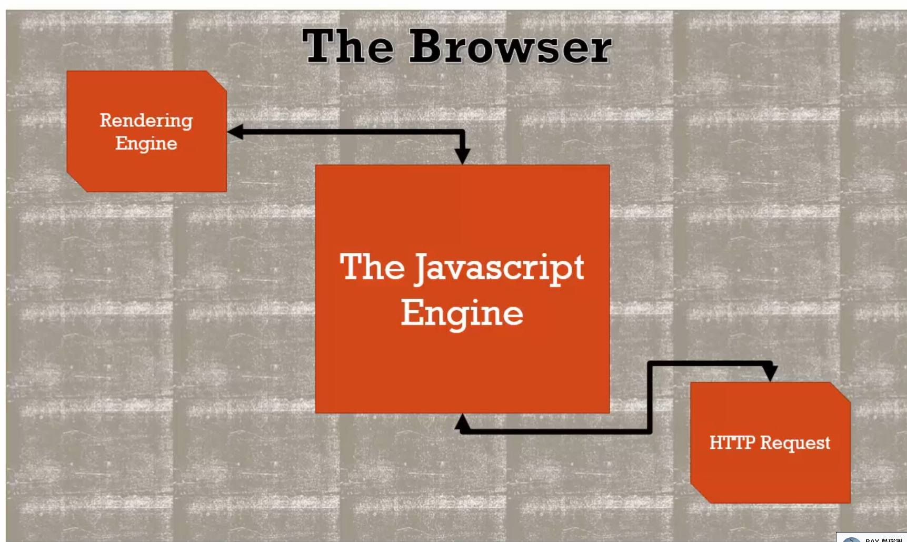
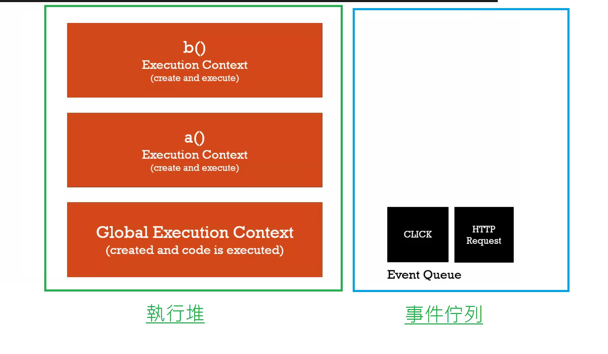
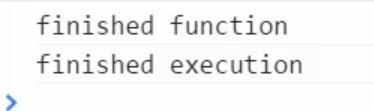
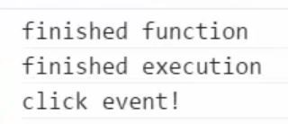

# 關於非同步回呼

javascript引擎本身不是獨自存在的，瀏覽器裡面還有其他東西，有其他引擎在javascript引擎外執行別的程式。

javascript引擎可以和瀏覽器內的其他東西溝通，但這些可能都是非同步執行的，這表示呈現引擎(Rendering Engine)、javascript引擎和http請求在瀏覽器內是非同步的，***裡面只有javascript引擎是同步的***。



javascript引擎內的等待列稱為事件佇列(event queue)，這裡面都是事件、事件通知，這些可能要發生的。所以當瀏覽器，在javascript引擎外的某處，有一個需要被通知的事件，在javascript引擎裡會被放到佇列裡。



事件佇列直到執行堆是空的之後才會被處理，直到javascript已經逐行執行完程式；所以這不是真正的非同步，而是瀏覽器把非同步的東西放到事件佇列，但原本的程式仍然繼續一行行執行。

javascript引擎用同步的方式處理非同步事件，在引擎外發生的事件被放到佇列。

當執行堆是空的之後，javascript會注意事件佇列，它預期那邊會有東西，如果有，它會看是否有函數會被這個事件觸發，所以在事件發生時，會創造執行環境給那個函數，然後這個事件處理結束，繼續到下一個佇列的事件。

事件佇列依據事件發生的順序處理，所以如果click事件發生，然後是http事件，它會先處理click事件，執行click事件的函數；完成函數後，再開始看佇列處理http事件。

非同步回呼在javascript是可能的，但非同步的部分是發生在javascript引擎外。

範例：

```javascript
function waitThreeSeconds(){
	var ms = 3000 + new Date().getTime();
	while(new Date() < ms){}
	console.log('finished function');
}
function clickHandler(){
	console.log('clikc event');
}
document.addEveneListener('click',clickHandler);
waitThreeSeconds();
console.log('finished execution');
```

正常情況下，滑鼠沒有在點擊的動作。



在 waitThreeSeconds(); 其間滑鼠點擊，console.log('clikc event');在最後才被印出來。

