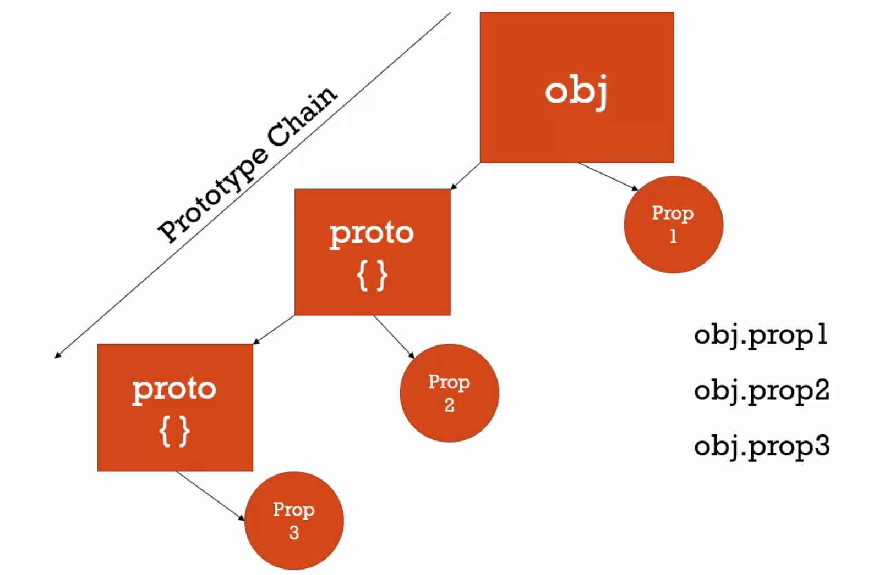
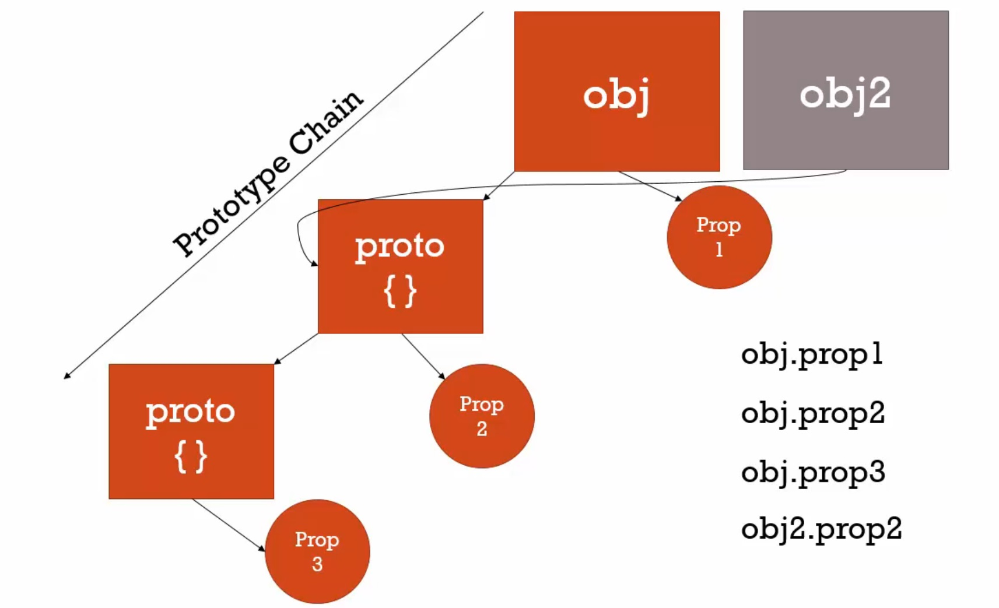

# 了解原型



有個物件obj，除了我們所賦予它的屬性之外，javascript引擎也賦予了它隱藏的屬性和方法。

在javascript中所有物件都有原型屬性，這個屬性會參考到另一個物件 -- proto，裡面會有屬性和方法。

當在obj裡面找不到 prop2時，會往它的原型鍊(prototype chain)去找 prop2。

而且原型的屬性是隱藏起來的，也就是取用原型的屬性或方法時不必這樣：

```javascript
obj.proto.prop2
```

這樣就好：

```javascript
obj.prop2
```

> ### 原型鍊 != 範圍鏈
>
> 原型鍊(prototype chain)：和取用屬性和方法有關，透過原型屬性連結，在上述的例子就是 proto
>
> 範圍鏈(scope chain)：尋找哪裡可以取用的變數



如果有另一個物件 obj2，它也可以指向同一個原型，只是另一個物件，只是參考，如果我們想的話，物件可以分享一樣的原型。

obj 和 obj2 共享 prop2和 prop3，但不是直接的。

prop2, prop3不在 obj和 obj2裡面，這是當javascript引擎到鍊上搜尋時，它會指向同一個地方。

----

```javascript
var persion = {
    firstname:'Default',
    lastname:'Default',
    getFullName:function(){
        return this.firstname + ' ' + this.lastname;
    }
}
var john = {
    firstname:'John',
    lastname:'Doe'
}
// 以下建立物件和設定原型的方式僅供DEMO使用，實務上不建議，會大幅降低效能
// 記得所有物件都有別的物件的參考
john.__proto__ = person; // 現在 john的原型指向person
```