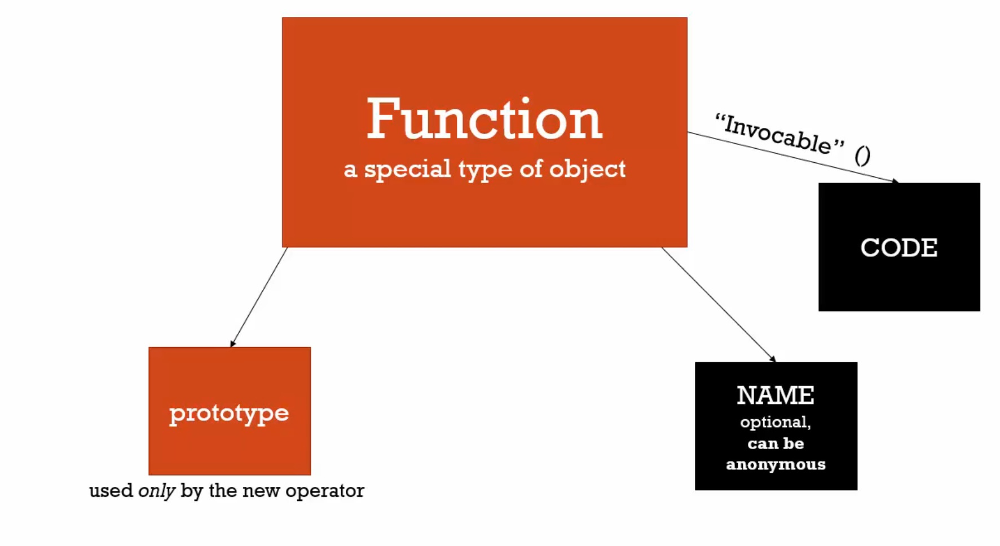

# 函數建構子與「.prototype」

當使用函數建構子時，它已經幫你設定好原型了



javascript所有的函數都有**原型屬性(prototype property)**，從它是空物件就誕生，除非將函數作為函數建構子來使用，不然原型屬性就只是待在那裏，永遠不會用到。

但一旦用「new」運算子呼叫函數，原型屬性就有意義了。

但是**函數的原型屬性 != 函數的原型**，函數的原型屬性其實就是函數建構子所建立的物件的**原型鏈指向的東西**。

之前不正確設定原型的方式：

```javascript
john.__proto__ = person;
```

設定原型的正確方式：

```javascript
function Person(firstname, lastname){
    this.firstname = firstname;
    this.lastname = lastname;    
}
//
Person.prototype.getFullName = function(){
    return this.firstname + ' ' + this.lastname
}                
var john = new Person('John','Doe');
console.log(john.getFullName()); // John Doe
var jane = new Person('Jane','Doe');
console.log(jane.getFullName()); // Jane Doe
//
Person.prototype.getFormalFullName = function(){
    return this.lastname + ', ' + this.firstname
} 
console.log(john.getFormalFullName());
console.log(jane.getFormalFullName());
```

為了效能，屬性在函數建構子裡面設定，因為它們常常是不同的值，但是共用的函數要用prototype的方式設定，這樣new了N個物件，就不會有N個函數了。

函數就是物件，會佔據記憶體空間，任何增加給它的東西都會佔據記憶體空間，如果將共用的函數給每個物件，表示每個物件都有自己的共用函數，這樣會佔據很多記憶體空間。

**以上是建立物件及其原型的一種方法。**