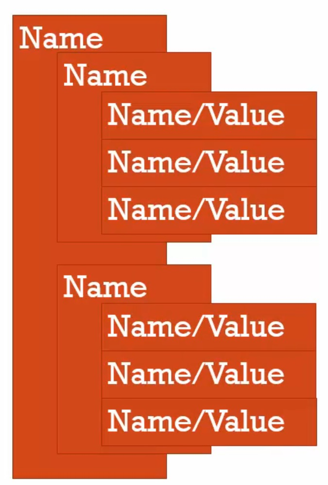
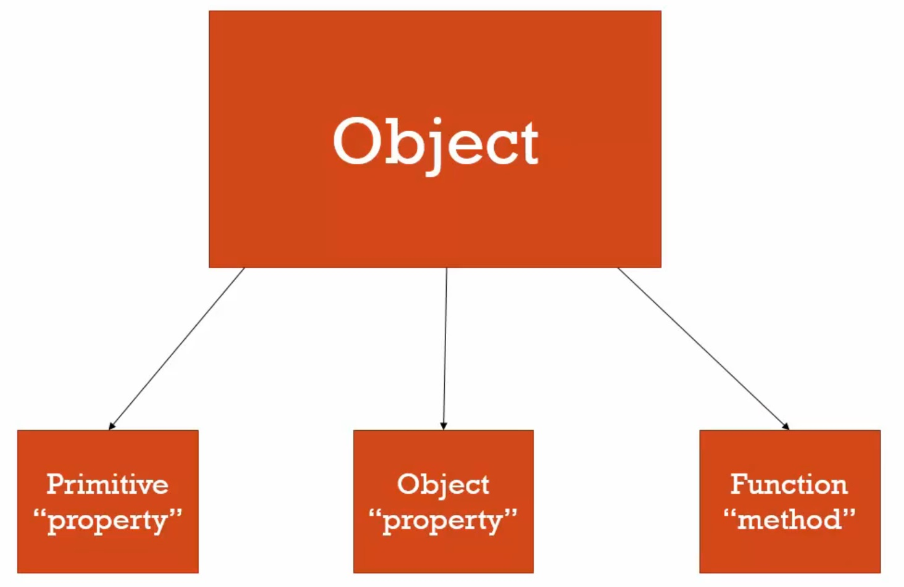
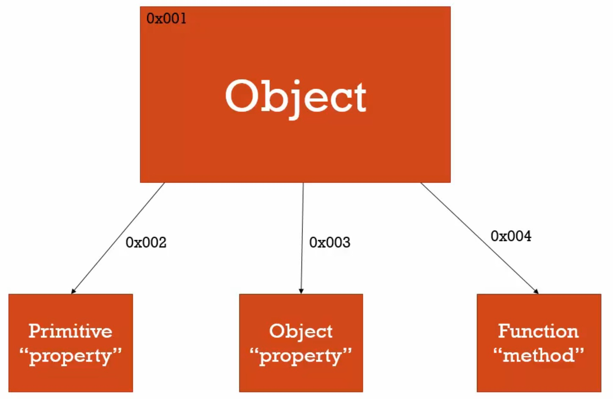

# 物件(Object)與點(Dot)

物件是「名稱/值」的組合，而這些值也可以是另一個「名稱/值」的組合：



另一種觀點看物件：



在記憶體中，核心物件會有一個記憶體的位址，然後可以參考到這些電腦記憶體中的屬性和方法的位址。



「 . 」跟「 ...[...]... 」都是運算子。

```javascript
var person = new Object(); // 這不是個建立object的好方式，但易於解說
person.name = 'Colin'; 
person['name'] = 'Colin'; // 使用動態字串建立屬性
console.log(person.name);
console.log(person['name']); // 使用動態字串取得屬性

// 物件在記憶體中是「名稱/值的組合」，值除了可以是基本型別之外也可以是物件或函數(方法)
person.address = new Object(); 
person.address.city = 'Taipei';
person.address.street = '100 Happy St.';
console.log(person.address.city);
console.log(person.address.street);
```