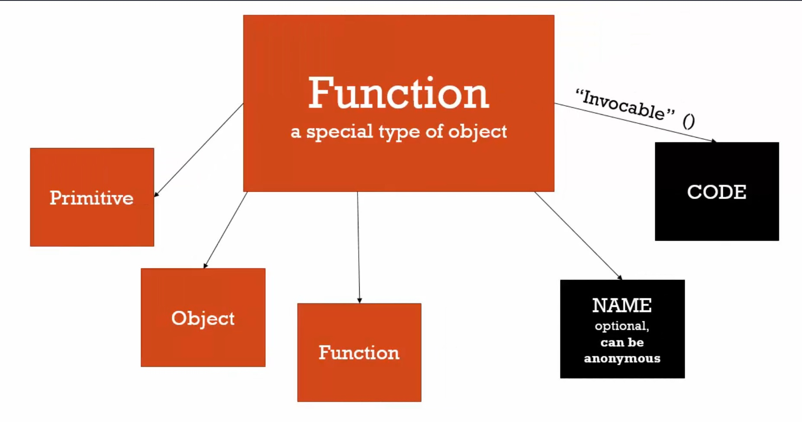
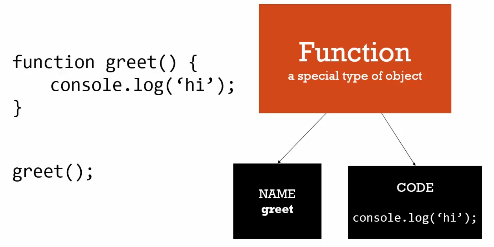

# 函數就是物件(functions are objects)

> ### 一級函數(first class functions)
>
> everything you can do with other types, you can do with functions.
>
> 可以對別的型別(物件、字串、數字...等)做的事，也能對函數做。可以指派一個變數的值為函數，或將函數當作參數傳入另一個函數，可用實體語法立刻(on the fly)創造函數。

函數物件長甚麼樣子？就像其他javascript物件一樣，在記憶體裡它是一個特殊型態的物件，它有所有物件的特色，還有一些其他屬性。

函數可以有屬性和方法，函數不一定要有名字，可以是匿名的。

特殊屬性 => 程式屬性(code property)，我們所寫的**程式碼**會成為**函數物件的特殊屬性**。

> 我們所寫的程式並非就是函數本身，這個函數是有其他屬性的物件；我們所寫的程式只是其中一個屬性，而特別的是它是可以被呼叫的，可執行的。



```javascript
function greet(){
    console.log('hi');
}
greet.language = 'english';
console.log(greet); // 會印出整個 function 的文字
console.log(greet.language); // 印出 'english'
console.log(greet()); // 'hi'
```

上述的程式碼看起來就像這樣：



函數只是程式碼的容器，它是物件。