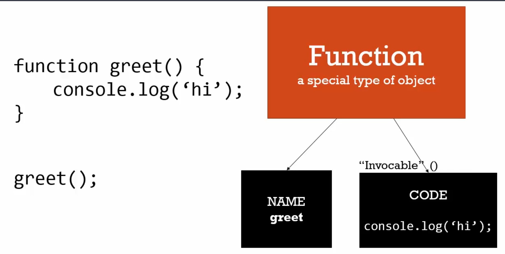

# 函數陳述句(function statement)與函數表示式(function expression)

> 表示式(expression)
>
> 表示式是程式碼的單位，會形成一個值。而不一定要將這個值儲存在變數。
>
> 函式表示式或任何表示式，最終會創造一個值。

```javascript
var a;
a = 3; // 「 = 」是個運算子，接受兩個值的函數，然後做一些事之後還傳一個值；這會設定這個值到記憶體中。
// 這個值可以是數字、字串或物件
a = {language:'english'};
1 + 2; // 這也是個表示式，回傳 3，但沒有將它會設定到記憶體中。
```


> 陳述句(statement)
>
> 陳述句會做某件事而已，不會回傳任何值。

```javascript
if([表示式]){
	...
}
// 陳述句就只是陳述句，不會回傳任何值
// 所以不能將陳述句設定給變數
var b = if(...){...}
    
```


-----------------

### 函數陳述句(function statement)



```javascript
// 函數陳述句(statement)
greet();
// 以下這段只是函數陳述句，因為當程式被執行，即使這個函數已經被放進記憶體，當這部分在執行階段被執行時，它不會做任何事，
function greet(){
	console.log('hi');	  
}

```

### 函數表示式(function expression)


```javascript
// 函數表示式(expression)
// 匿名函數就是沒有名稱屬性的函示，可以利用指向物件位址的變數名稱找到這個函數
var anonymousGreed = function(){ 
	console.log('hi');
}
// 上述那段就是表示式，因為它回傳一個值，當這段程式碼被執行時，會叫出函數物件，會讓物件被創造出來
anonymousGreed(); // 執行
```


```javascript
greet(); // hi
// 因為下面那一段被提升了(hoist)，當javascript看到function這個字在新的一行時，它會知道你在創造一個新函數
// 在執行環境的創造階段時，函數陳述句被提升(hoist)到記憶體中
function greet(){
	console.log('hi');	  
}
// ---------------------------------------------
anonymousGreed(); // undefined is not a function...
// 在這邊javascript看到一個變數，它會把所有的變數初始值設定為undefined，函數表示式沒有被提升(hoist)
var anonymousGreed = function(){ 
	console.log('hi');
}
```


```javascript
// 將函數傳入另一個函數，因為函數也是個物件
function log(a){
  	a();
	console.log(a);  
}
log(function(){
	console.log('hi');
})
```

以上是一級函數的概念，可以把函數傳入別處，就像使用變數一樣，其他像javascript的語言也可以。

函數程式語言(functional programming)