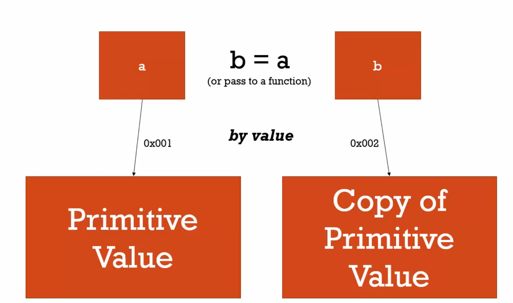
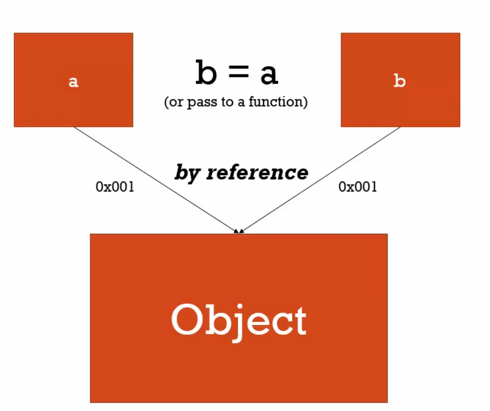

# 傳值(call by value)與傳參數(call by reference)

### 傳值(call by value)

將一個純值(primitive value)「3」設定給一個變數 a，現在 a有個位址，它知道那個純值的記憶體位址；設定一個新變數 b，設定它等於 a，也可以說傳入 a到一個函數，這個函數名稱是 b。

在 javascript，下圖是上述動作會發生的事，b這個新變數會指向一個新位址，一個新的記憶體地點，而那個純值的拷貝被放到新的記憶體地點。

參考(reference)是到記憶體的位址



### 傳參數(call by reference)

但跟純值不同的是，將一個物件設定給變數 a，再設定一個新變數 b等於 a，這兩個變數都是指向同一個記憶體位址，b不會指向一個新位址，而是指向 a的記憶體位址，沒有新的物件被創造，沒有物件的拷貝被創造。

可以想像成這個物件有了兩個別名。




> 在 javascript中，所有物件都是 call by reference的，當用等號設定它們相等時。

----------------------

範例：

#### call by value(primitive value)

```javascript
var a = 3;
var b;
b = a;
a = 2;
console.log(a); // 2
console.log(b); // 3
/**
 * 因為「3」是純值，所以當設定 b等於 a時，是創造一個新的記憶體位址，將純值拷貝過去，之後 a跟 b就沒有關
 * 係了，改變 a的值 b也不會受影響。
 */
```

#### call by reference( all objects including functions)( even parameters)

```javascript
var c = { language:'english'};
var d;
d = c;
c.language = 'france';
console.log(c.language); // france
console.log(d.language); // france
/**
 * 因為 c是個物件，所以當設定 d等於 c時，並沒有創造一個新的記憶體位址，也沒有新的拷貝被創造，它們都指向同一
 * 個記憶體位址，所以改變 c也會改變 d。
 */
// 傳入一個物件到函數中，表示它們是被傳入它的參考點(by reference)，而不是 by value，所以obj會指向d的記憶體位址，d已經指向c的記憶體位址。
function changeLanguage(obj){
	obj.language = 'chinese';
}
changeLanguage(d); // obj = d;
console.log(c.language); // chinese
console.log(d.language); // chinese
```

#### 例外情形：等號運算子會設定一個新的記憶體(空間)位址

```javascript
// 接續 call by reference的例子
c = { language:'japanese'};
console.log(c.language); // { language:'japanese'};
console.log(d.language); // { language:'chinese'};
// 在這裡，設定c為一個新的值，然後等號運算子會設定一個新的記憶體位址給c，然後放入那個值，所以d和c不再指向同一個記憶體位址了

// 這是特殊例子，現在就不是 call by reference了，因為等號運算子看到新的物件還不存在於記憶體，它必須建立另一個記憶體位址給這個新物件，所以它建立一個新的記憶體位址，然後將c指向他。

// 在上個例子中，d = c時，c已經存在了，它是個物件，所以等號運算子只要把d指向同一個記憶體位址就好。
```


在其他語言可能可以決定要 by value或by reference，但在 javascript沒有選擇，純值就是 by value，物件就是 by reference。

..

mutate：改變某件事。

immutable：不可變的。

..

