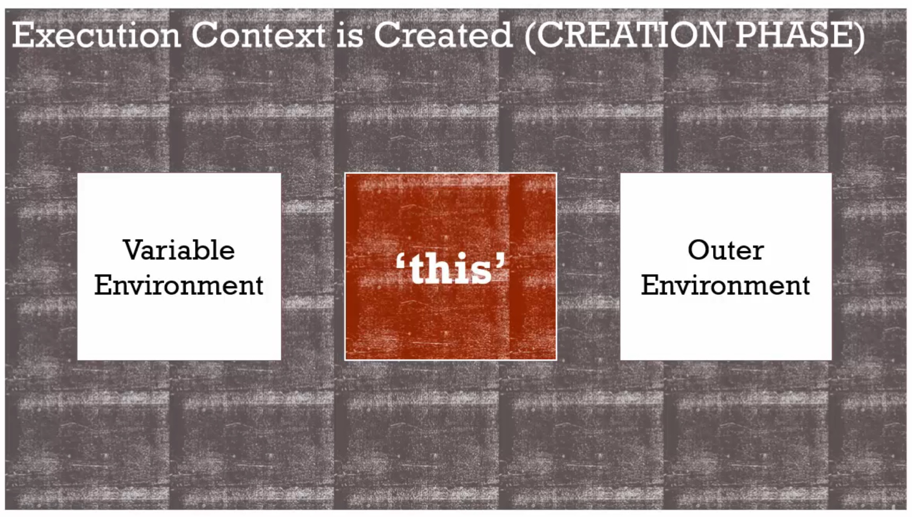

# 函數、物件與「this」




當函數被呼叫時，會創造新的執行環境，每個執行環境都會有自己的變數環境，也就是被創造在函數裡的變數所在，它可以參考到外部環境(外部詞彙環境，也就是物理位置所在)，讓函數能夠隨著範圍鏈一路找下去。

這時javascript也會給我們一個不曾宣告的東西「this」。this會指向不同的物件，一個不同的東西，依據函數如何被呼叫，在某些情況下，this會依據函數如何被呼叫而改變，javascript引擎會決定this應該指向別的東西。

------

```javascript
function a(){
	console.log(this); 
	this.newvariable = 'hello'
}
var b = function(){
	console.log(this);
}
a(); // console global object:window
console.log(newvariable); // hello。任何連結到全域物件的變數都可以這樣參考到。
b(); // console global object:window
```

即使有三個執行環境( a(),b()跟全域 )，在每一種情況中，他們都有自己的this關鍵字，在這例子中它們都指向同一個記憶體位址(window)。

每當函數被呼叫，新的執行環境就被創造，javascript引擎會決定 this指向誰。

-----

```javascript
var c = {
	name:'The c Object',
	log:function(){
    	this.name = 'Update c Object';
    	console.log(this); // console c object 
	}
}
c.log() 
```

在這個例子中，this會指向物件的方法，當函數就是連結到物件的方法時，this關鍵字成為裡面有方法的物件，也就是c。

當函數是一個物件的方法時。

javascript認為this連結到一個物件，所以this關鍵字就會指向包含它的物件。

----

#### javascript的bug?

```javascript
var c = {
	name:'The c Object',
	log:function(){
    	this.name = 'Update c Object';
    	console.log(this); // 0.console c object and name is 'Update c Object'
      
     	var setName = function(newName){
        	this.name = newName; // 1.
     	} 
        setName('Update c object again'); // 2.
      	console.log(this); // 3.console c object and name is 'Update c Object'
	}
}
c.log() 
```

不是在 // 2.的地方重新設定name了嗎？怎麼在 // 3.的地方印出來的結果還是跟 // 0.一樣?

原來在 // 1.的時候，name被等號運算子設定到了全域物件window那邊了，表示 // 1.的函數，它的執行環境被創造時，this指向了全域物件，即使它在我所創造的物件c裡面。

很多人認為這樣錯了，但javascript就是這樣運作的。

下面的修改可以達到我們所要的效果：

```javascript
var c = {
	name:'The c Object',
	log:function(){
      	var self = this; 
    	self.name = 'Update c Object';
    	console.log(self); // console c object and name is 'Update c Object'
      
     	var setName = function(newName){
        	self.name = newName;
     	} 
        setName('Update c object again');
      	console.log(self); // console c object and name is 'Update c object again'
	}
}
c.log() 
```

ps. let關鍵字，是替代var的另一個關鍵字，它可以清除一些這樣的問題。

