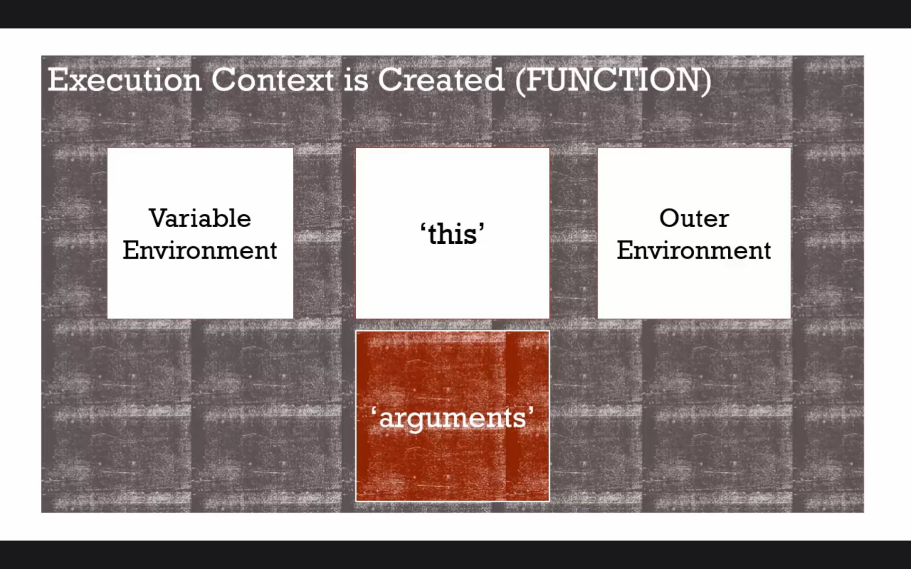

# arguments與spread




> 函數的執行環境建立之後，javascript會自動給予幾個東西
>
> 1. 該函數自己的變數環境
> 2. this
> 3. 外部環境
> 4. arguments

javascript允許呼叫函數時**不給參數**，或是傳入的**參數數量大於函數所宣告的數量**。

javascript會從**左到右**處理傳入函數的參數。

### arguments

> ### 參數(arguments)
>
> 概念上只是傳入函數的變數的另一個名稱而已，所以也可以稱呼為 parameters；
>
> 但javascript給予的這個 arguments關鍵字可以包含所傳入函數的參數。

```javascript
function greeting(firstName, lastName, language){
    console.log('firstName='+firstName);
    console.log('lastName='+lastName);
    console.log('language='+language);
    console.log(arguments);
}        
greeting();
greeting('Colin'); // firstName:Colin,lastName:undefined,language:undefined
greeting('Colin','James'); // firstName:Colin,lastName:James,language:undefined
greeting('Colin','James','Ford');
greeting('Colin','James','Ford','Colin1','James1','Ford1');
------------------------
// 也可以這樣寫
function name(){
	  console.log(arguments);
}  
name();
name('Colin');
name('Colin','James');        
name('Colin','James','Ford');  
```

「arguments」是 javascript自動幫我們預設好的一個參數，它包含了所有傳入 greetint函數的參數。

是個類陣列(Array-like)，不是陣列，但大部分的陣列方法都可以使用。

### spread

新版 javascript才有的東西。

```javascript
function greeting(firstName, lastName, language,...others){
    console.log('firstName='+firstName);
    console.log('lastName='+lastName);
    console.log('language='+language);
    console.log(arguments);
	console.log(others);
}        
greeting();
greeting('Colin');
greeting('Colin','James');        
greeting('Colin','James','Ford');
greeting('Colin','James','Ford','Colin1','James1','Ford1');
---
// 相比 arguments的方式，spread語意比較清楚
function name(...others){
	console.log(others.length);
}        
name();
name('Colin');
name('Colin','James');        
name('Colin','James','Ford');  
```