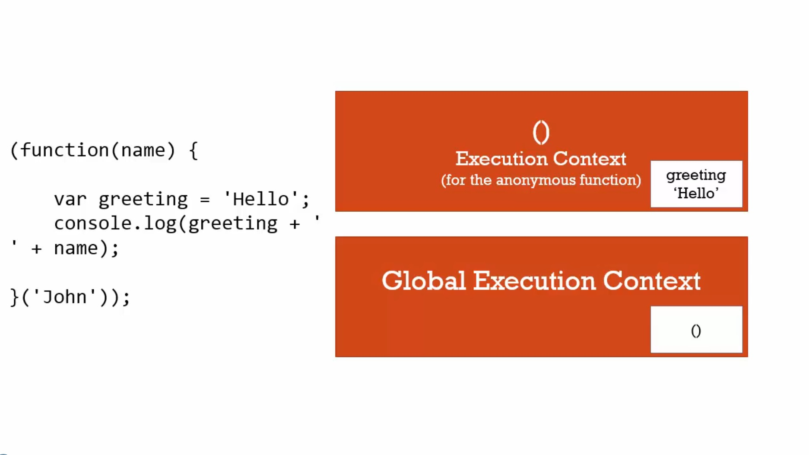
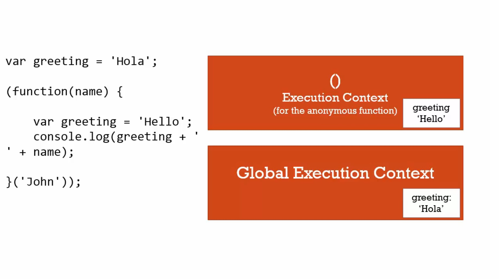

# 框架小叮嚀-IIFE與安全程式碼

### greeting.js

```javascript
(function(name){ // 1
    var greeting = 'Hello';
    console.log(greeting + ' ' + name);
}('John')); // 2
```

當程式開始跑之後，有全域執行環境，裡面還沒有東西，因為沒有變數，沒有函數陳述句被提升(hoist)。

然後執行到 // 1這一行，這整個IIFE，當執行到了函數表示式的部分，它會在全域環境創造函數物件記憶體，且是匿名的，這是個物件，有程式碼。

接著到了 // 2這一行，javascript看到呼叫這個函數的括號，一個新的執行環境被創造，給剛剛所創造的匿名函數，在IIFE裡面創造的變數不是在全域，因為在執行一個函數，有自己的執行環境，任何我宣告的變數，都在函數內部創造，不會接觸到全域環境。



---

### app.js

```javascript
var greeting = 'Hola';
```

引用

```javascript
// 這不會創造新的東西，只會堆在對方上面
<script src='greeting.js'></script>
<script src='app.js'></script>
```

下圖是引用了 greeting.js跟 app.js之後的情況，greeting並不會互相覆蓋。

將程式碼包在IIFE裡，保證它不會和其他東西起衝突。




-----

如果想要在IIFE裡面使用全域物件的東西，只要將瀏覽器裡的全域物件 window傳進去就好。

```javascript
(function(global,name){ // 1
    var greeting = 'Hello';
    console.log(greeting + ' ' + name);
}(window,'John')); // 2
```

