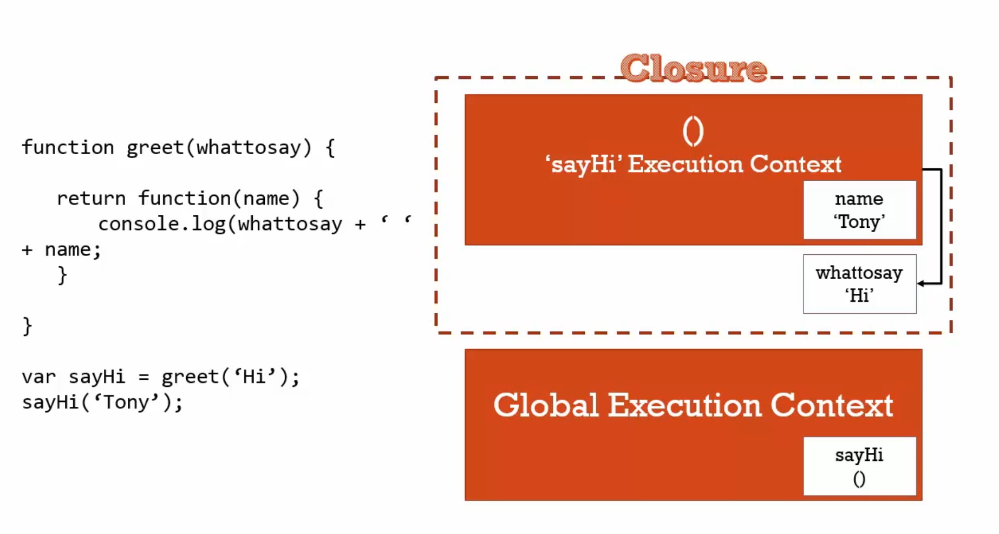

# 瞭解閉包(closure)


```javascript
function greet(whattosay){    
    return function(name){
        console.log(whattosay + ' ' + name);
    }
}        
var sayHi = greet('Hi');
sayHi('Colin');
```

執行情況依序如下列圖片：

圖一


圖二


每個執行環境都會有自己的記憶體空間，變數和函數都被創造在那裏面，而當執行環境沒了記憶體空間會如何？

一般情況下 javascript引擎會執行GC清除它，但當執行環境結束時，記憶體空間還在，雖然這邊 greet()函數已經離開執行堆了，但所創造的變數還留在記憶體某處。

圖三


接著 sayHi()函數創造自己的執行環境，但是在自己的環境中找不到變數 whattosay，所以就順著範圍鏈(scope chain)往外面一層找，就看到剛剛 greet()所創造的 whattosay。

圖五



雖然 greet()函數已經結束了，執行環境離開執行堆了，但任何在它裡面所創造的的函數，仍然可以參考到 greet()函數在記憶體的位置。 --> greet沒了，執行環境沒了，但它在記憶體中還在。

javascript引擎要確保我的函數在仍然可以在範圍鏈中找到，執行環境可以把外部變數包住、關住，那些它應該要參考到的變數，即使執行環境已經沒了。

這個包住所有可以取用的變數的現象稱為**閉包(closure)**。

何時呼叫函數沒差，不需要擔心它的外部環境是否還在執行，javascript引擎永遠會確保無論我在執行哪個函數，它都能取用到應該取用到的變數，範圍沒有改變。