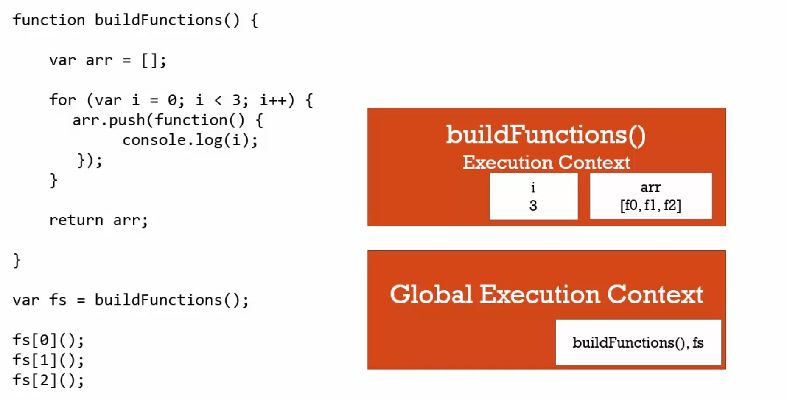
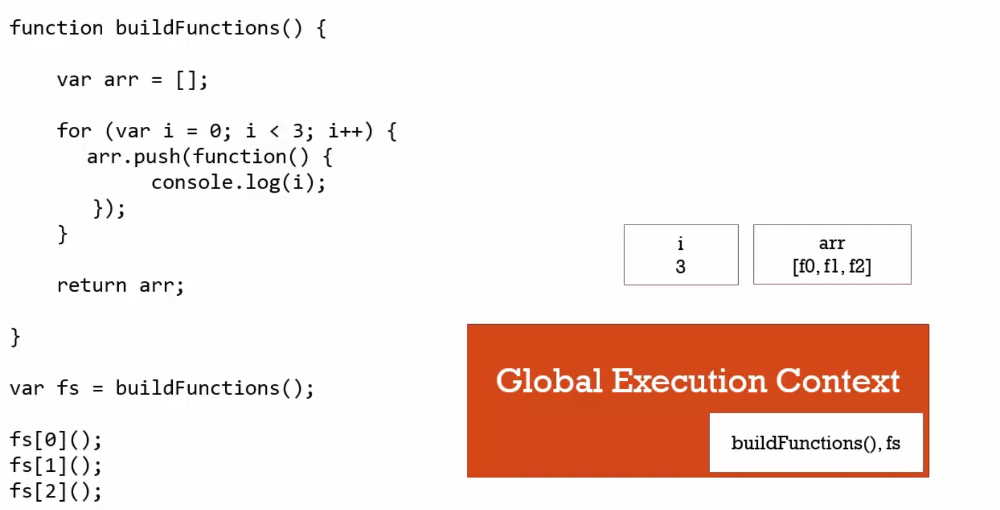
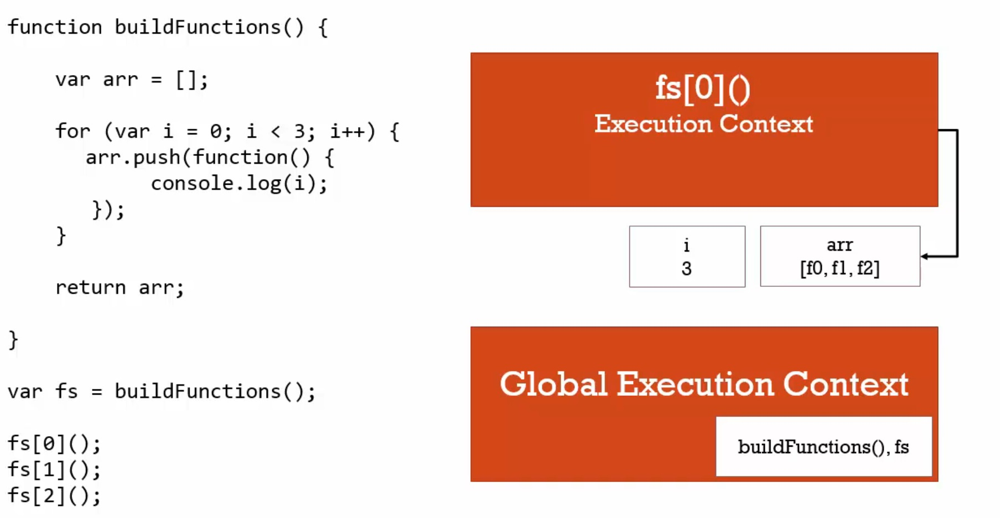
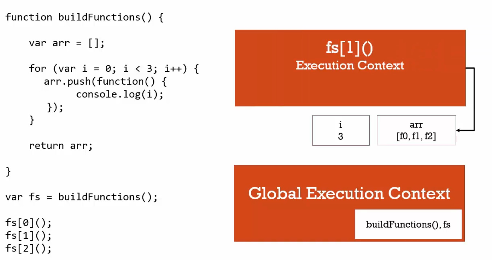
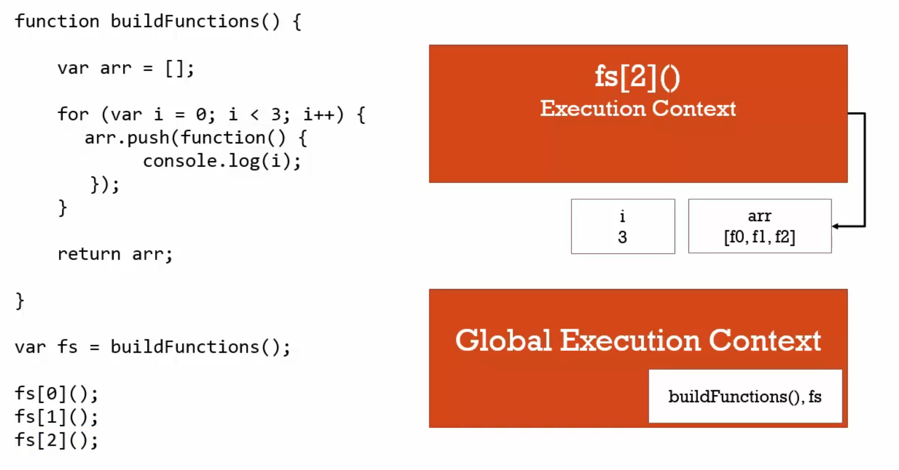

# 瞭解閉包(二)

```javascript
function buildFunctions(){
    var arr = [];    
    for(var i = 0; i < 3; i++){
        arr.push( // 1
            function(){
                console.log(i); // 2
            }        
        );
    }
    return arr;    
}
var fs = buildFunctions();
fs[0](); // 3 -> console.log 3
fs[1](); // 4 -> console.log 3
fs[2](); // 5 -> console.log 3
```

在 // 1將函數加入arr時，// 2的console尚未執行。一直到 // 3，// 4，// 5時 // 2的console才執行。

可以想成是 fs內的函數都來自同一個父親，當我們在 // 3 // 4 // 5問它們的父親現在幾歲時，不會因為他們出生的時間不一樣(arr.push(...))，父親的年紀(i)就不一樣。

以下是依序執行的情況：











---

但如果想要印出 0、1、2呢？有兩個方法可以用

### 一、after ES6

使用 let關鍵字宣告一個新的變數保存 i的值。

```javascript
function buildFunctions(){
    var arr = [];    
    for(var i = 0; i < 3; i++){
        let j = i; //
        arr.push(
            function(){
                console.log(j);
            }        
        );
    }
    return arr;    
}
var fs = buildFunctions();
fs[0](); // console.log 0
fs[1](); // console.log 1
fs[2](); // console.log 2
```

### 二、before ES6

為了保存 i的值，需要不同的執行環境放到陣列(arr)，當迴圈執行時需要更大的範圍包住現在的值，

獲得執行環境唯一的方法就是執行函數，IIFE這時就派上用場了。

```javascript
function buildFunctions(){
    var arr = [];    
    for(var i = 0; i < 3; i++){        
        arr.push(
            (function(j){ // IIFE在這邊會創造另一個執行環境
                return function(){
                    console.log(j);
                }                    
            }(i))     
        );
    }
    return arr;    
}        
var fs = buildFunctions();
fs[0]();
fs[1]();
fs[2]();
```

