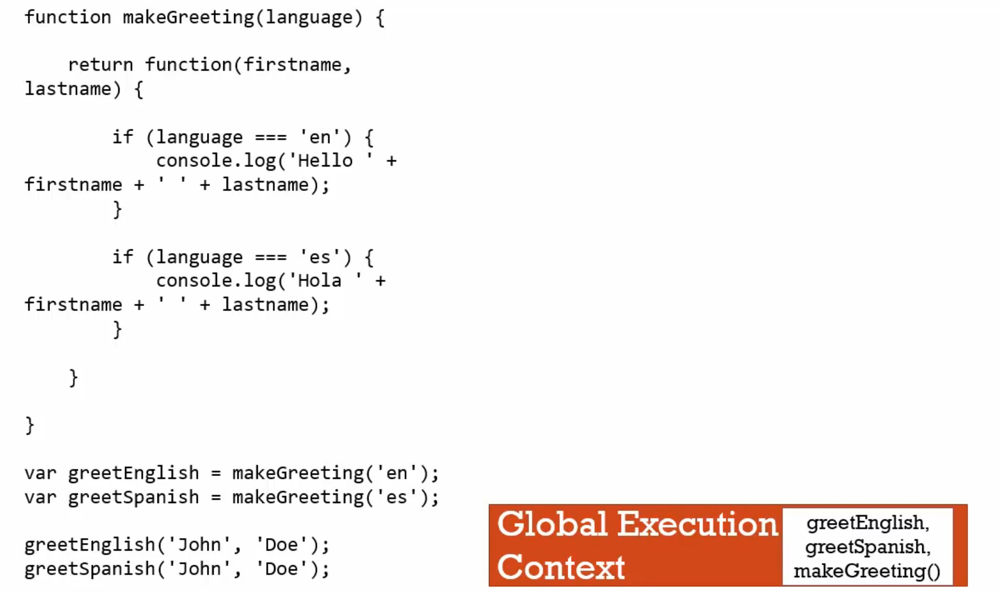
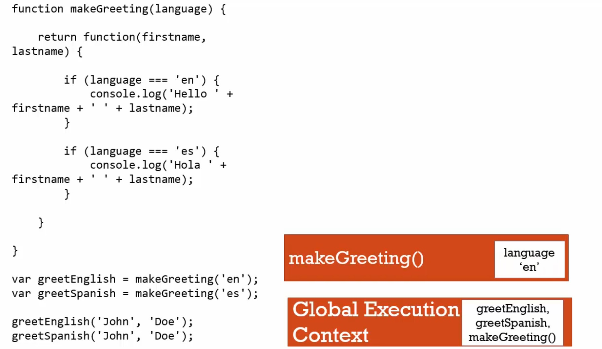
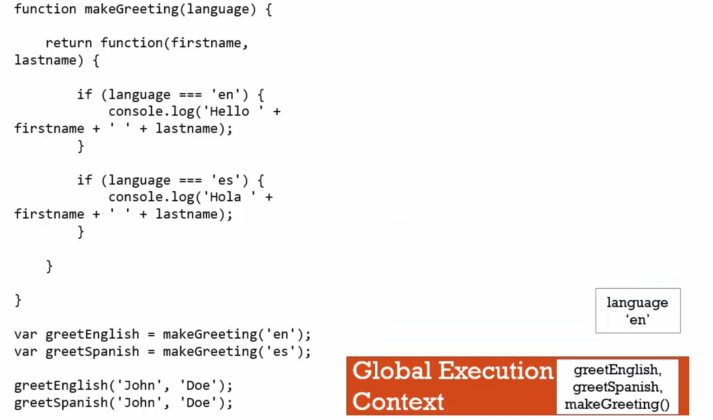
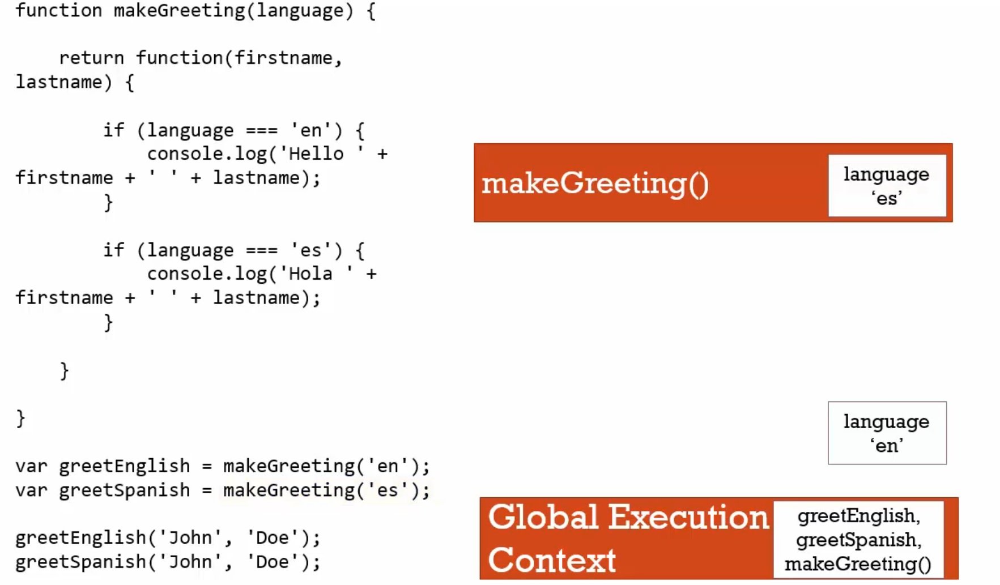
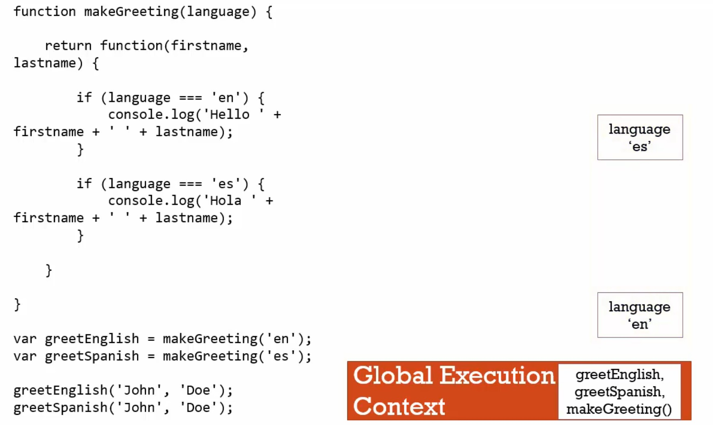
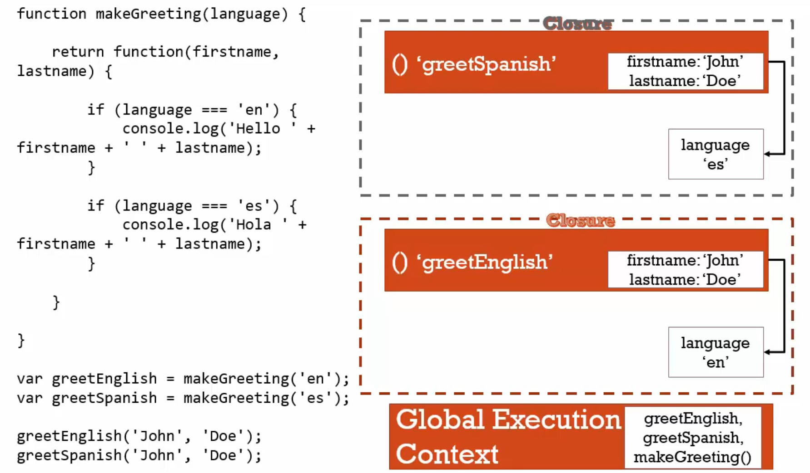

# 框架小叮嚀-function factories

```javascript
function makeGreeting(language){
    return function(firstName,lastName){
        if(language === 'en'){
            console.log('Hello ' + firstName + ' ' + lastName);    
        }
        if(language === 'es'){
            console.log('Hola ' + firstName + ' ' + lastName);    
        }        
    }
}        
var greetEnglish = makeGreeting('en');
var greetSpanish = makeGreeting('es');        
greetEnglish('John','Doe'); // Hello John Doe    
greetSpanish('John','Doe'); // Hola John Doe
```

下列圖片是執行情的情況：













