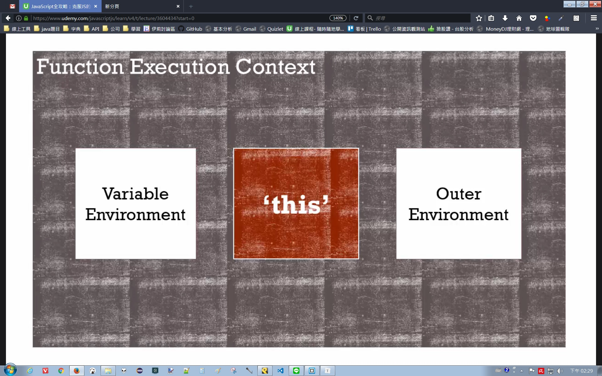
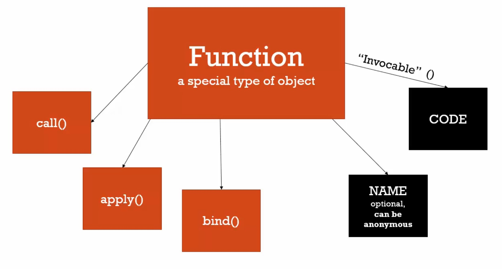

# call(), apply() and bind()

在每個執行環境中，都會有變數環境、外部環境與 this。如果不是在物件裡面所創造出來的函數，「this」預設是指向全域環境的。

那可以控制「this」去指向誰嗎？



每個函數都有三個方法可以取用



- bind：會創造新拷貝，會回傳新的函數
- call：不會創造拷貝，而是直接執行函數
- apply：跟 call一樣，只是它接收的是陣列

```javascript
var person = {
    firstname:'John',
    lastname:'Doe',
    getFullName:function(){
        var fullname = this.firstname + ' ' + this.lastname;
        return fullname;
    }
}  
var logName = function(lang1, lang2){
    console.log('Logged: ' + this.getFullName());
    console.log('Arguments: ' + lang1 + ' ' + lang2);
} 
logName(); // error
// ----------------------------- bind ------------------------------------
var logPersonName = logName.bind(person); // 在這裡影響javascript，傳入 this變數想要指向的物件
logPersonName(); // Logged: John Doe
// 也可以這樣做
var logName = function(lang1, lang2){
    console.log('Logged: ' + this.getFullName());
    console.log('Arguments: ' + lang1 + ' ' + lang2);
}.bind(persion);
logName(); // Logged: John Doe
logName('en');
logName('en','es');
// ------------------------------ call -------------------------------------
logName.call(persion,'en','es');
// ------------------------------- apply -------------------------
logName.call(persion,['en','es']);
// call, apply也可以這樣寫
(function(lang1, lang2){
    console.log('Logged: ' + this.getFullName());
    console.log('Arguments: ' + lang1 + ' ' + lang2);
}).apply(persion,['en','es']);
```

------------

## 組合技巧

### 函數借用(function borrowing)( call or apply)

可以用其他物件的方法，就像自己本身有它的程式屬性。

```javascript
var person = {
    firstname:'John',
    lastname:'Doe',
    getFullName:function(){
        var fullname = this.firstname + ' ' + this.lastname;
        return fullname;
    }
}  
var persion2 = {
    firstname:'Colin',
    lastname:'Lee',
}       
console.log(persion.getFullName.apply(persion2)); // console -> Colin Lee
```

### function currying( bind)

> 建立函數的拷貝，並且設定預設值

用 call或 apply，傳入參數就只是傳入參數；但用 bind，可以創造函數的拷貝。

```javascript
function multiply(a, b){
    return a*b;
}        
var multipleByTwo = multiply.bind(this, 2); // 在這個拷貝的函數裡，傳入的參數'2'會變成永久值，a = 2
// 可以把上面那行想成下面這行
function multipleByTwo(b){
    var a = 2;
    return a*b;
}
multipleByTwo(4,2); // return 8
multipleByTwo(5,2); // return 10
var multipleByTwoAndThree = multiply.bind(this, 2, 3); // a = 2, b = 3
multipleByTwoAndThree(3,2); // return 6
multipleByTwoAndThree(5,2); // return 6
```

